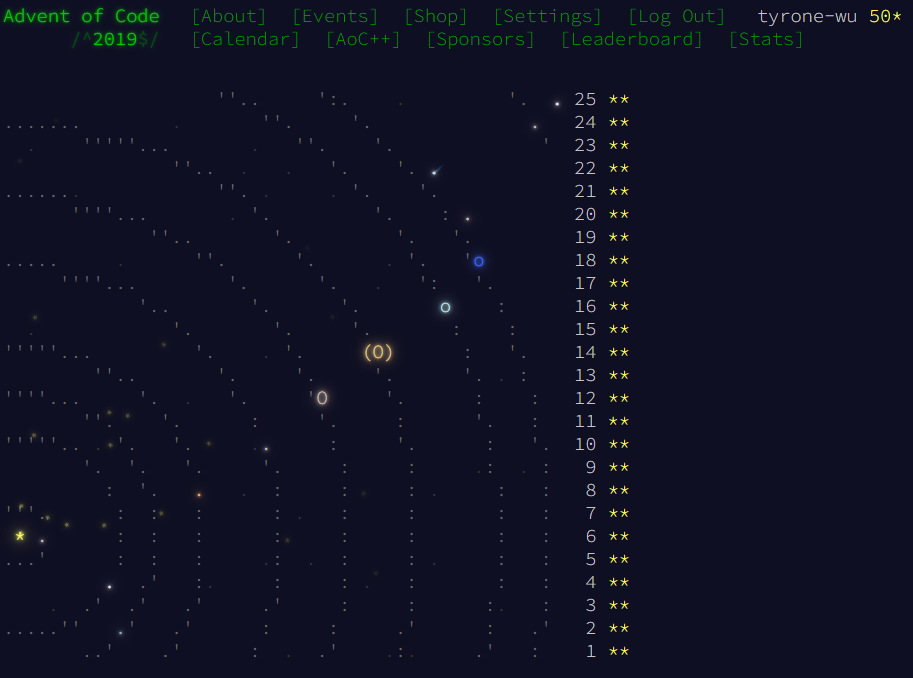

# 🎄 Advent of Code 2019



# 🎄 AdventOfCode-typescript-template 🎄

This is a TypeScript boilerplate for Advent of Code.

built with ❤️ and:

- [typescript](https://www.typescriptlang.org/) 👨‍💻
- [vitest](https://vitest.dev/) 🧪
- [bun](https://bun.sh/) 🧅

## 👷‍♂️ Project structure

the project has the following structure:

```
src
- days: contains the solutions for the puzzles
- scripts: utility scripts for development lifecycle
- types: types and interfaces
- utils: utility scripts used for development and problem solving (i.e read an input file)
```

## 🚀 Getting started

This readme assumes you are using [pnpm](https://pnpm.io/) as package manager, but any other package manager will do.

The runtime used for this project is bun [bun](https://bun.sh/), check the docs for installing it.

install all required dependencies with `pnpm i`

## 🎄 Adding a new puzzle

when the new AoC puzzle is available run `pnpm init-day {day}`

replace `{day}` with the number of the advent day, i.e. `pnpm init-day 2`.

This command will create a new directory in the `days` folder with the following content

- `Puzzle.ts`: the boilerplate module with the placeholder methods for solving both daily puzzles
- `index.txt`: the input file where to add the puzzle input

The structure of the boilerplate module is the following:

```typescript
const first = (input: string) => {
  console.log(input);
  return 'solution 1';
};

const expectedFirstSolution = 'solution 1';

const second = (input: string) => {
  console.log(input);
  return 'solution 2';
};

const expectedSecondSolution = 'solution 2';

export { first, expectedFirstSolution, second, expectedSecondSolution };
```

## 🔧 Development

When your solution is ready, or when you want to start developing incrementally (watch mode) run `pnpm dev {day}` where {day} is the day you are working on, i.e. `pnpm dev 1` will run the puzzle class for day 1.

```bash
# Run the solution for the specific puzzle day.
$ pnpm dev $DAY
```

## 🧪 Testing

You can run test for all puzzles agains their expected output with `pnpm t` this will test all the solutions in the `days` folder.

```bash
# Run the test cases for all existing puzzle days.
$ pnpm t

# Run the test case for specific puzzle day.
$ pnpm t -t $DAY
```

## 🛫 Contributing

Every contribution is welcome. Just fork this repo and open a MR with your changes, and don't forget to add your name to the contributors section of this README.

## 👨👩 Contributors

[Francesco Maida](https://edge33.github.io)

[Devin Spikowski](https://github.com/vegeta897)

[Nitish Thiyagarajan](https://www.tnitish.com)
